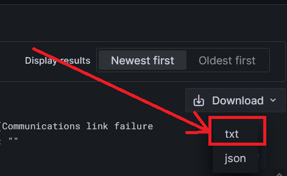
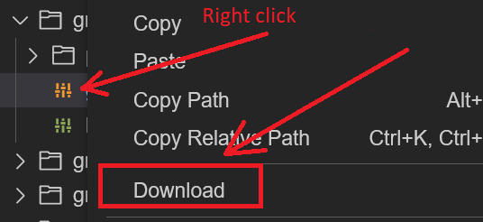

##Task1
In grafana:
1) Select all log lines starting from 2022-10-01 to 2022-12-31 in the `/var/log/app.log` file where an error of type `ERROR` was thrown.
2) Save the result in `txt` format on your PC and rename file to `result.txt`.
    

##Task2
Change configuration in grafana config file `/etc/grafana/grafana.ini`.
1) Change default UI theme from `dark` to `light`.
2) Add header 'myHeader' that the server adds to each HTTP(S) responses,
   value in this header must be `User is: nameOfGrafanaUser. Host is: nameOfGrafanaHost`.
-  Spaces do not matter, but periods, colons upper and lower case do.
- `nameOfGrafanaUser` - Name of grafana user.
- `nameOfGrafanaHost` - Name of host.
3) Download and save config file `grafana.ini` on your PC.
4) Push `result.txt` and `grafana.ini` to the Git repository for checking.
- On Git should be a green checkmark after checking.
   

Solution

Save file from grafana

Save file from the environment.

